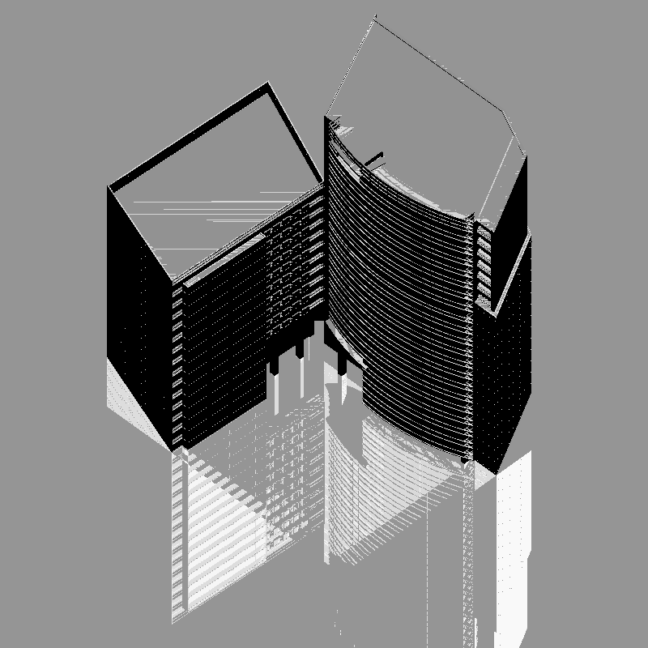
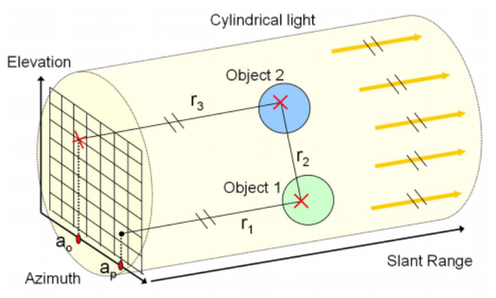
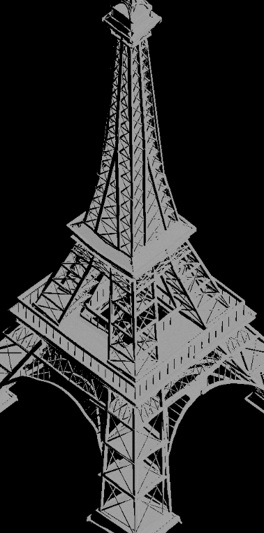

CIS565 Final Project - Hardware Accelerated SAR Simulator
================

**University of Pennsylvania, CIS 565: GPU Programming and Architecture, Final Project**

* David Li
  * [LinkedIn](https://www.linkedin.com/in/david-li-15b83817b/)
* Xiaoyu Du
  * [LinkedIn](https://www.linkedin.com/in/xiaoyu-du-67261915b/)
* Di Lu
  * [LinkedIn](https://www.linkedin.com/in/di-lu-0503251a2/), [personal website](https://www.dluisnothere.com/)
* Tested on: Windows 11, i7-12700H @ 2.30GHz 32GB, NVIDIA GeForce RTX 3050 Ti
* Timeline: This project was worked on from 11/7/2022 to 12/12/2022

Milestone presentations can be found [here](https://drive.google.com/drive/folders/1hWNa2depmKZVKnT07e0hjxMevFkCth30?usp=sharing)!

## Introduction and Motivation

In 3D rendering, Pathtracing is a technique that generates realistic looking scenes/images by simulating light ray bounces. To that effect, Synthetic Aperture Radar (SAR) simulation works very similarly. Both processes cast rays from a starting point: In path tracing, the pinhole camera; In SAR simulation, the antenna which emits waves. This means operations to make an SAR simulator are "embarrassingly parallel" and can be optimized by the GPU. 

Our team lends our knowledge of GPU-based raytracing to better understand its applications outside of visible light-based image outputs. To that effect, we are not Radar experts the code here is implemented to the best of our abilities based on research. 

Check out the next section for a brief overview on what an SAR is!

Our hope is that this can contribute to the development of more open-source SAR simulators that can be helpful for aircraft/vehicle designers. We also hope that these outputs can be used as easy data-gathering for any AI-based image-recognition for the typically blurry images produced by real SARs.

## Gallery of Results

|  Azimuth-Range view of New York | Orthogonal view of New York |
| ----------------- | ----------------- | 
|  |   |  

| Azimuth-Range view of a skyscraper | Orthogonal view of a skyscraper | 
| ------------------ | ----------------- | 
|  |  | 

| Azimuth-Range view of the Eiffel Tower | Orthogonal view of the Eiffel Tower | 
| ------------------ | ----------------- | 
|  |  | 

| Azimuth-Range view of a Stylized City Block | Orthogonal view of a Stylized City Block | 
| ----------------- | ----------------- | 
| ah | ah | 

_GLTF CREDITS GO HERE_

## Crash Course: Synthetic Aperture Radar

SAR (Synthetic Aperture Radar) is a type of Radar that is commonly used in military Aircrafts for its advantage in creating images that do not depend on lighting or weather. SARs emit radar waves and capture signals that are bounced back in order to construct an image. 

### Real World SARs

Traditional Radars capture images by emitting radio waves from an antenna (also called the **Aperture**; We will mostly use "antenna" to describe this). They rely on the large wavelength of the radio waves emitted to penetrate harsh weather conditions and foliage in order to generate clear images. The angular resolution of the final image is determined by the wavelength to the size of the aperture.  However, this implies that longer wavelengths would, in turn, require a longer antenna to generate the same resolution of image. With moving aircrafts, this condition is not ideal. 

In order to bypass this issue, a smaller antenna is mounted onto a moving vehicle, and the vehicle takes various snapshots of the same spot of environment over a moving trajectory. This creates the illusion of a larger radar aperture by combining multiple viewpoints, thus producing a larger "Synthetic Aperture".

A real SAR collects data in the following steps (May be difficult to see on github dark mode)

_Fig 1. Logical Flow of how a REAL SAR collects data_

Here is what typical SAR outputs look like:

|   |  |
| ----------------- | ----------------- |
|  |  |

### SAR Simulation Research

Modeling the rays in an SAR simulator is quite  different from a path tracer in computer graphics even though the underlying principle of shooting rays and calculating some energy based off of the rays is the exact same. For instance, there are no lights in the SAR scene, and the camera (proxy for aperture) is treated as the source of energy. Additionally, there are not as many ray bounces in SAR simulation as there would be in a path tracer. 

| Real SAR Data Collection Process  | Simulated SAR Data Collection Process  |
| ----------------- | ----------------- |
|  |  |

_Fig 2. Logical Flow of how a SIMULATED SAR collects data compared to a REAL SAR_

First, we simulate the SAR at orthogonal view. Imagine each column of pixels as what the antenna "sees" as the vehicle is moving along its trajectory (AKA the Azimuth axis). For each azimuth value, the antenna shoots primary rays through each pixel of its column. Each primary ray will hit an object and cast a secondary ray. If the secondary ray also hits an object at point _p_, then a ray parallel to primary ray will be cast. If this last ray hits the original aperture, then a backscatter value can be calculated.

Second, we convert the orthogonal view image to a project in the azimuth-range plane. The following diagram is a description of what an azimuth-range plane image represents. 

Here, the x-axis represents azimuth (which is equivalent to the trajectory line along which the vehicle is moving). The y-axis represents range, which represents distance relative to the antenna. Each red plot corresponds to a non-black pixel on the final phase history image. If a pixel is non-black, then it means a signal was received back. Its greyscale value represents the strength of that signal.

Hence, if there is a black band in the middle of the azimuth-range plane, it means no signal was received by the antenna at that distance away.

Modeling the behavior of materials and SAR rays appears to be a non-trivial task. Based on our research and readings, only diffuse surfaces and specular surfaces have mathematical models developed.

## Scene File Description

The scene files used in this project are laid out as blocks of text in this order: Materials, Textures (if any), and Objects in the scene. Each Object has a description of its translation, scale, and rotation, as well as which material it's using, and if it's a basic shape (such as sphere or cube), then that is also specified. If not a basic shape, then it specifies a path to its obj. If the Object also has a texture, then it will refer to the Id of the texture. Using Ids to keep track of scene attributes prevent over-copying of shared data between Objects.

The Camera object in the scene also represents the antenna.

## Core Features

Our project is built on top of a prior homework assignment: CUDA Path Tracer. This would give us a lot of control over how rays are generated as well as the BxDF functions that would most accurately reflect the physical behavior of SAR rays, since we implemented all of these functions ourselves.

### GLTF Support

Our SAR simulator supports scene files, which can contain CUBE shapes, SPHERE shapes, and GLTFs. GLTFs are powerful web-based 3D object descriptors that allow for multiple meshes to be part of the same object. These meshes can be categorized into nodes which describe its location transform. They also allow the object to have multiple texture maps representing its base color, metallic roughness, emission, and more!

### SAR Wave Simulation

We use the lambertian and specular reflection models to simulate the behavior of radar signal. We give the user the flexibility to adapt the lambertian and specular reflection property of the material to simulate the interaction of EM wave with different materials. 

### SAR Backscatter

Backscatter are radar signals that reflected back to the SAR sensor. signals can be directly backscatter to the sensor or have multiple bounces before reaching the SAR sensor. The amplitude and the range of the signal are recorded by the sensor in a 3D coordinate of azimuth(moving direction of the antenna), elevation(position of hitted object on the elevation plane) and range(the distance between antenna and the object hitted).

| Double Bounce  | Direct Backscatter | Complete image plane |
| ----------------- | ----------------- | ----------------- |
|  |  |  |

### Acceleration Structures

We are using a kd-tree as a bounding volume hierarchy. A kd-tree is a binary tree where each node is split along one axis-aligned hyperplane. The k in a kd tree represents the number of dimensions. So for our uses k is three. The root node is split along the x-axis. The next layer is split along Y, then Z and then back to X etc. For the 2d case, the partitions may look something like this.

### GUI Elements Description

## Performance Analysis

We tested a few scenes with and without the use of a kd tree. The scenes we tested varried in triangle count from around 35 thousand to over 1.2 million. These scenes had their execution time to reach 20 iterations measured in seconds. Though conventional path tracers may use thousands of iterations to converage into an acceptable image, our SAR simulator cconverges much faster. 

With lower triangle counts, the kd tree helps very little, though it does contribute to a considerable speed up. However, as the triangle counts get higher, the kd tree is vital in completing execution in an acceptable amount of time. Being over 20 times faster than just using a bounding box!

## Bloopers! :)

## References and Related Works

